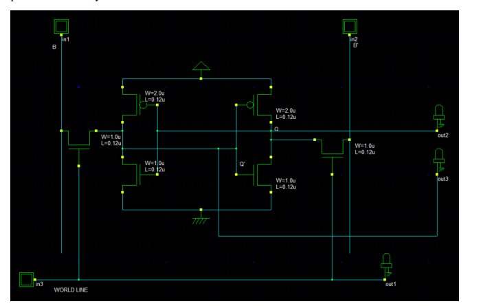
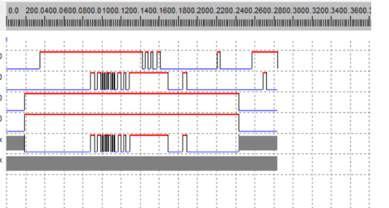

# 6T SRAM Memory Cell – Design & Simulation

## 📜 Declaration

I hereby declare that this project presents the design and simulation of a 6-Transistor (6T) SRAM memory cell using CMOS technology.

The SRAM cell was designed and simulated using DSCH, and its behaviour was analyzed under Hold, Write, and Read operations.

This project was carried out as part of the B.Tech Electronics & Electrical Engineering coursework at Lovely Professional University.

 

---

## 📑 Table of Contents

1. [Introduction](#1-introduction)
2. [Project Objectives](#2-project-objectives)
3. [6T SRAM Cell Architecture](#3-6t-sram-cell-architecture)
4. [Simulation Setup](#4-simulation-setup)
5. [SRAM Circuit Design](#5-sram-circuit-design)
6. [Operating Modes](#6-operating-modes)
7. [Simulation Waveform](#7-simulation-waveform)
8. [Results and Discussion](#8-results-and-discussion)
9. [Applications](#9-applications)
10. [Conclusion](#10-conclusion)
11. [Technologies Used](#11-technologies-used)
12. [Author](#author)

---

## 1. Introduction

Static Random Access Memory (SRAM) is a high-speed volatile memory used in modern digital systems.

A 6T SRAM cell uses six transistors to store one bit of data. The storage section consists of two cross-coupled CMOS inverters, while two NMOS access transistors provide access to the cell through complementary bit lines.

The stored data is represented by two complementary internal nodes, Q and Q′.

In this project, a 6T SRAM memory cell was designed and simulated using DSCH to study its behaviour under Hold, Write, and Read operations.

---

## 2. Project Objectives

The main objectives of this project are:

- To design a 6T SRAM memory cell using CMOS technology.
- To understand the data storage mechanism of an SRAM cell.
- To design and simulate the SRAM circuit using DSCH.
- To analyze Hold, Write, and Read operations.
- To observe the output response at Q and Q′.
- To verify stable and complementary Q and Q′ outputs.

---

## 3. 6T SRAM Cell Architecture

The 6T SRAM memory cell consists of:

- Two cross-coupled CMOS inverters
- Two NMOS access transistors
- Complementary bit lines B and B′
- Word Line (WL)
- VDD
- Ground

The two cross-coupled CMOS inverters form a bistable storage element.

The NMOS access transistors control the connection between the internal storage nodes and the complementary bit lines.

The cell stores one bit of digital information in the form of complementary logic states at Q and Q′.

---

## 4. Simulation Setup

The SRAM cell was designed and simulated using **DSCH**.

### Input Signals

- Bit Line (B)
- Complementary Bit Line (B′)
- Word Line (WL)

### Output Signals

- Q
- Q′

Transient analysis was performed to observe the time-dependent behaviour of the SRAM cell.

The simulation was used to study the response of the cell during Hold, Write, and Read operations.

---

## 5. SRAM Circuit Design

### 🔧 DSCH Simulation Circuit

  

  <b>Figure 1: 6T SRAM Memory Cell designed using DSCH</b>

The circuit contains two cross-coupled CMOS inverter stages and two NMOS access transistors controlled by the Word Line.

---

## 6. Operating Modes

### 1. Hold Operation

When the Word Line (WL) is LOW, the access transistors remain OFF.

The SRAM cell is isolated from the bit lines and the cross-coupled inverters maintain the previously stored data.

### 2. Write Operation

During the Write operation, the Word Line is activated.

The access transistors turn ON and the required data is applied through the complementary bit lines.

The new data is stored in the SRAM cell.

### 3. Read Operation

During the Read operation, the Word Line is activated and the stored data affects the bit lines.

A voltage difference is generated on the bit lines, allowing the stored information to be detected while maintaining the stored value.

---

## 7. Simulation Waveform

### 📈 Transient Simulation Result

  

  <b>Figure 2: Transient simulation waveform of the 6T SRAM memory cell</b>

The transient waveform illustrates the behaviour of the SRAM cell under different input conditions.

The waveform shows the input signals and corresponding output responses during the simulation.

---

## 8. Results and Discussion

The simulation analysis demonstrates the expected operation of the designed 6T SRAM memory cell.

### Observed Results

- Stable data storage during Hold operation.
- Data transfer during Write operation.
- Correct output response during Read operation.
- Complementary Q and Q′ outputs.
- Stable storage behaviour under the simulated conditions.

The simulation results confirm the basic functionality of the designed 6T SRAM memory cell.

---

## 9. Applications

6T SRAM cells are widely used in:

- Processor Cache Memory
- Registers
- Embedded Memory
- High-Speed Digital Systems
- Microprocessors
- System-on-Chip (SoC) Designs

---

## 10. Conclusion

The 6T SRAM memory cell was successfully designed and simulated using CMOS technology and DSCH.

The circuit behaviour was analyzed under Hold, Write, and Read conditions.

The simulation results demonstrate stable data storage and complementary Q and Q′ outputs, confirming the proper functionality of the SRAM memory cell.

This project provides practical understanding of SRAM cell architecture, CMOS transistor-level design, and VLSI circuit simulation.

---

## 11. Technologies Used

- **CMOS Technology**
- **6T SRAM**
- **DSCH**
- **VLSI Design**
- **Transient Analysis**

---

## 👨‍💻 Author

**Veerendra**

B.Tech – Electronics & Electrical Engineering  
Lovely Professional University
